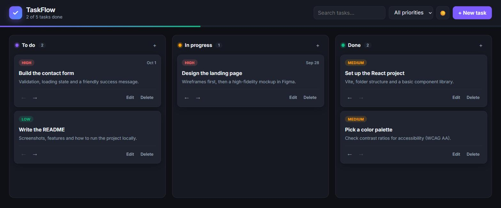

<div align="center">

# ✅ TaskFlow

**A clean, fast Kanban board for organizing your work, built with React.**

[](https://zubair9590-svg.github.io/taskflow/)


<br />
[](https://github.com/zubair9590-svg/taskflow/actions/workflows/deploy.yml)

<a href="https://zubair9590-svg.github.io/taskflow/"></a>

</div>

## ✨ Features

- **Three-column board**: *To do*, *In progress* and *Done*, with a live progress bar
- **Drag & drop** cards between columns, or use the arrow buttons (keyboard-friendly)
- **Priorities and due dates**, with overdue tasks highlighted
- **Search and filter** by text or priority
- **Dark and light themes**
- **Auto-saves** to `localStorage`, so your board is still there after a reload
- **Accessible**: native `<dialog>` modal, labelled controls and visible focus states

## 🛠️ Tech stack

| | |
| --- | --- |
| UI | [React 19](https://react.dev) (function components + hooks) |
| Build tool | [Vite](https://vite.dev) |
| Styling | Plain CSS with custom properties for theming |
| Deployment | GitHub Actions → GitHub Pages |

## 🚀 Getting started

```bash
git clone https://github.com/zubair9590-svg/taskflow.git
cd taskflow
npm install
npm run dev        # start the dev server
npm run build      # production build in dist/
```

## 📁 Project structure

```
src/
├── App.jsx                  # board state, filters and theme
├── components/
│   ├── Column.jsx           # a column + drag-and-drop target
│   ├── TaskCard.jsx         # a single task card
│   └── TaskModal.jsx        # create / edit dialog
├── hooks/
│   └── useLocalStorage.js   # useState that persists to localStorage
├── data.js                  # columns and sample tasks
├── index.css                # design tokens, layout and themes
└── main.jsx                 # entry point
```

## 💡 What I learned

- Managing state immutably with React hooks, and writing a reusable custom hook
- Implementing drag and drop with the native HTML5 Drag and Drop API
- Building a light/dark theme with CSS custom properties
- Setting up continuous deployment to GitHub Pages with GitHub Actions

## 📄 License

[MIT](LICENSE) © Zubair
